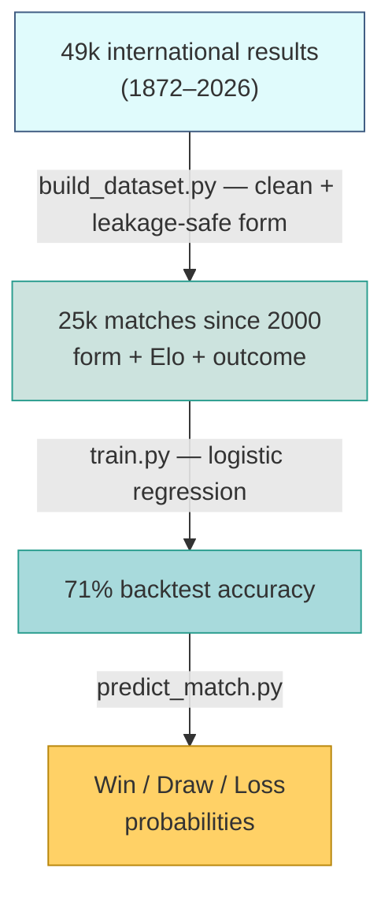

# ⚽ World Cup 2026 Match Predictor


June–July 2026 is packed with sport — the World Cup and the UFC White House card —
so I built a model to predict match outcomes and compare it against the Polymarket
betting market and other public models.

It estimates **win / draw / loss** probabilities for any international football
fixture from each team's recent form and an Elo strength rating.

> **Brazil vs Morocco:** the model said an even match (36/28/36); the market
> heavily favoured Brazil (59/26/17). It finished **1–1**, expected goals 1.28–1.24.

<p align="center">
  
</p>

---

## Try it

```bash
python predict_match.py "Netherlands" "Japan"
```
```
3-WAY            logreg    XGBoost
  Netherlands     35.7%     35.3%
  Draw            30.2%     28.6%
  Japan           34.1%     36.1%
```

## How it works



Two rules keep the backtest honest: form uses only matches *before* each game,
and the model is tested on *future* matches (split by date, never shuffled).

## What moved the accuracy

| Version | Change | Backtest |
|---|---|---|
| v1 | form only | 65.0% |
| v2 | XGBoost + StatsBomb features (xG), few matches | 57.3% |
| **v3** | **+ Elo rating** | **71.2%** |
| v6 | XGBoost on form + Elo | 70.7% |
| v7 | + match importance | 71.1% |

Adding Elo gave +6 points. Switching to XGBoost gave nothing (three tries).
Here, the features matter more than the model.

<p align="center">
  
</p>

## Are the probabilities trustworthy?

**Calibration** — when the model says 30%, the home side wins ≈29% of the time,
so the percentages mean what they say.

<p align="center">
  
</p>

**Why each prediction looks the way it does (SHAP)** — for both matches the two
Elo ratings nearly cancel, then the opponent's defence and the neutral venue pull
the favourite below a coin flip.

<p align="center">
  
  
</p>

**How stable is it?** — re-running across different settings (form window, Elo
speed), the predictions barely move: Brazil stays 32–42%, the Netherlands 34–37%.

<p align="center">
  
  
</p>

## Model vs Polymarket vs other models

Tracked against the **Polymarket** market and **[sujar.tech](https://www.instagram.com/sujar.tech/)**
(a popular analyst running a StatsBomb + XGBoost model).

| Match | This model | sujar.tech | Polymarket | Result |
|---|---|---|---|---|
| Brazil – Morocco | 36 / 28 / 36 | 39 / 32 / 29 | 59 / 26 / 17 | **1–1** |
| Netherlands – Japan | 36 / 30 / 34 | 53 / 29 / 18 | 48 / 28 / 26 | **2–2** |
| France – Senegal | 59 / 25 / 16 | — | 67 / 22 / 13 | **3–1 France** ✓ |
| England – Croatia | 46 / 30 / 24 | — | 59 / 25 / 17 | **4–2 England** ✗ |

So far the model reads matches as more even than the market, which leans on the
favourite. On Brazil–Morocco that paid off.

<p align="center">
  
</p>

Netherlands vs Japan showed the same split: the market backed the Netherlands, the
model called it roughly even and rated Japan higher. It finished **2–2** (xG
0.70–0.54) — two for two, the model's "even" read beat the market's favourite-lean.

England vs Croatia broke the streak: the model called it near-even (England 46%)
but England won **4–2**. The market (59%) had it right — a clear reminder that the
"more even than the market" read isn't always correct (now 2 of 3).

---

A second model applies the same approach to **UFC** (fighter Elo + skill ratings),
benchmarked against Polymarket and the analyst leo.taps. On the June 15 card it went
**3/4** and beat the market. Full write-up: [`mma/RESULTS.md`](mma/RESULTS.md).

## Does it make money?

The real test of an edge is a bankroll, not accuracy. I pulled the closing
Polymarket odds for all 32 played World Cup matches and ran Kelly-sized paper
bets. Short version: the market picks winners better than the model (59% vs 56%),
and the betting ROI is dominated by variance — it swung from −13% to +45% just by
adding 12 matches. A "bet the draw" angle looks positive but needs 100+ matches to
trust. Honest write-up: [`BETTING.md`](BETTING.md).

## Goal markets — Elo + Poisson hybrid

The W/D/L classifier can't price goal-based markets (over/under, both-teams-to-score,
exact score). A **Poisson** model can — it models each side's *expected goals* (λ)
and derives the full scoreline distribution. But a naive Poisson built on raw goals
**breaks across confederations**: Germany's goals (vs strong UEFA sides) and Côte
d'Ivoire's (vs weaker African qualifiers) aren't comparable, and with no shared
opponents the model collapsed the match to a coin flip (37/26/37 — nonsense).

The fix is a **hybrid**: **Elo sets the expected goals** (it propagates strength
across the whole match graph, so cross-confederation works), and **Poisson turns
those λ into a distribution**:

```
Germany vs Côte d'Ivoire (Δelo 161)  →  λ: Germany 2.36, Côte d'Ivoire 0.76
  W/D/L:      73 / 17 / 10      (naive Poisson said 37/26/37; market 67/20/14)
  over 2.5:   60%   ·   both score: 48%   ·   likely score: 2–0
```

So Elo answers "who", Poisson answers "how many". Code: `predict_hybrid.py`.
*(Caveat: the λ fit bakes in home advantage, so a neutral match slightly over-favours
the "home" side — the 73% is a few points high.)*

## Files

| file | role |
|---|---|
| `build_dataset.py` | turn raw matches into leakage-safe form features |
| `train.py` / `train_v3_elo.py` | train + backtest |
| `predict_match.py` | predict any fixture (logreg + XGBoost, 3-way) |
| `make_viz.py`, `make_shap.py`, `make_sensitivity.py` | the charts above |
| [`mma/`](mma/) | the UFC predictor (fighter Elo, skill ratings, method/round) |

## Run it

```bash
python -m venv .venv && source .venv/bin/activate
pip install pandas scikit-learn xgboost matplotlib seaborn shap requests python-dotenv

mkdir -p data
curl -sSL https://raw.githubusercontent.com/martj42/international_results/master/results.csv \
  -o data/international_results.csv
python build_dataset.py
python predict_match.py "Brazil" "Morocco"
```

## Data

- [martj42/international_results](https://github.com/martj42/international_results) — match results
- [StatsBomb open data](https://github.com/statsbomb/open-data) — event data (xG, possession)
