# ⚽ World Cup 2026 Match Predictor


June–July 2026 is packed with sport — the World Cup and the UFC White House card —
so I built a model to predict match outcomes and compare it against the Polymarket
betting market and other public models.

It estimates **win / draw / loss** probabilities for any international football
fixture from each team's recent form and an Elo strength rating.

> **Brazil vs Morocco:** the model said an even match (36/28/36); the market
> heavily favoured Brazil (59/26/17). It finished **1–1**, expected goals 1.28–1.24.

<p align="center">
  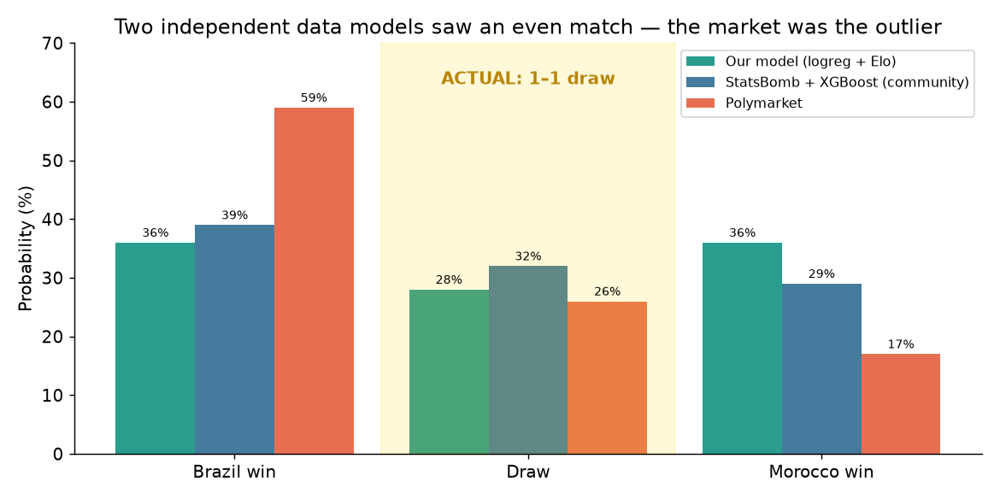
</p>

---

## Try it

```bash
python predict_match.py "Netherlands" "Japan"
```
```
3-WAY            logreg    XGBoost
  Netherlands     35.7%     35.3%
  Draw            30.2%     28.6%
  Japan           34.1%     36.1%
```

## How it works

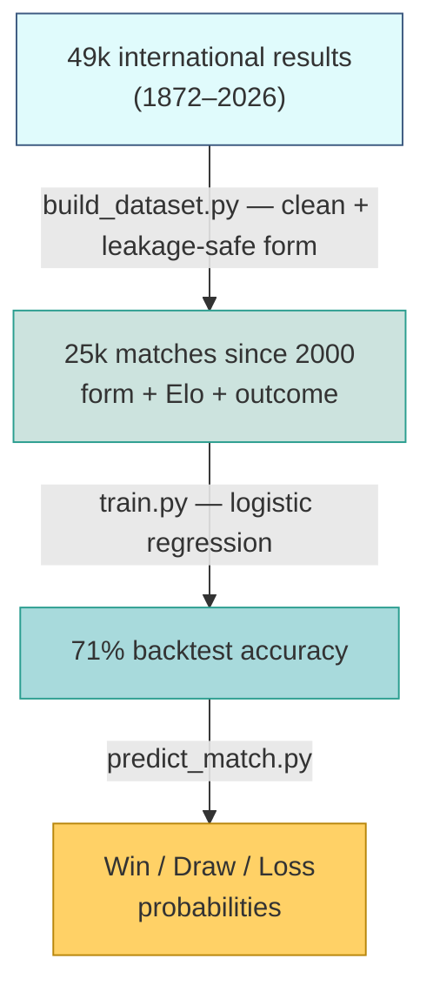

Two rules keep the backtest honest: form uses only matches *before* each game,
and the model is tested on *future* matches (split by date, never shuffled).

## What moved the accuracy

| Version | Change | Backtest |
|---|---|---|
| v1 | form only | 65.0% |
| v2 | XGBoost + StatsBomb features (xG), few matches | 57.3% |
| **v3** | **+ Elo rating** | **71.2%** |
| v6 | XGBoost on form + Elo | 70.7% |
| v7 | + match importance | 71.1% |

Adding Elo gave +6 points. Switching to XGBoost gave nothing (three tries).
Here, the features matter more than the model.

<p align="center">
  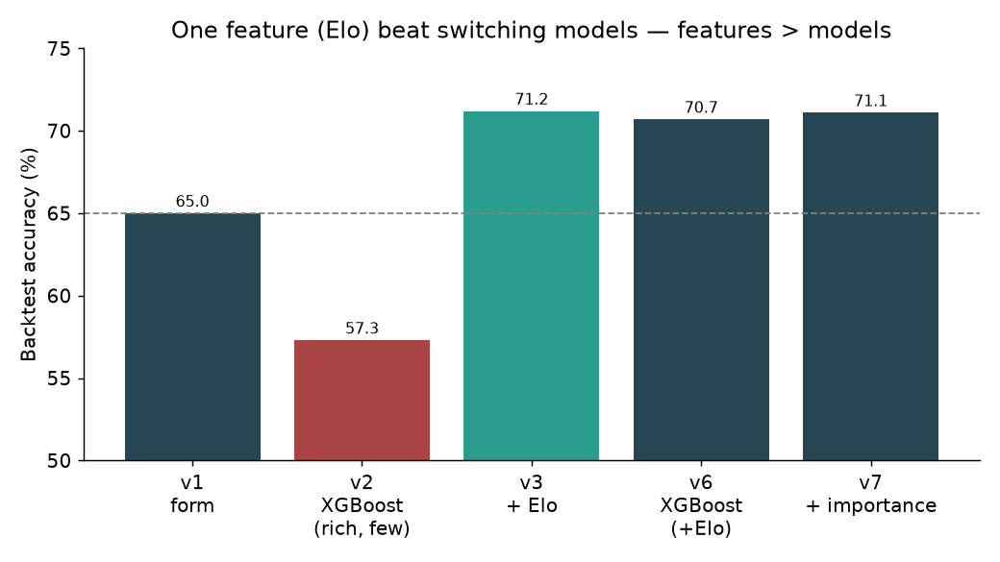
</p>

## Are the probabilities trustworthy?

**Calibration** — when the model says 30%, the home side wins ≈29% of the time,
so the percentages mean what they say.

<p align="center">
  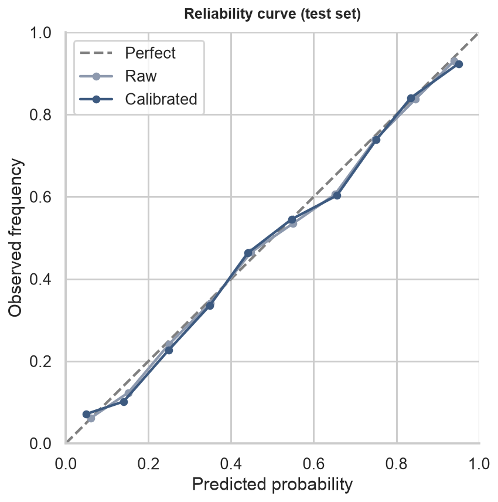
</p>

**Why each prediction looks the way it does (SHAP)** — for both matches the two
Elo ratings nearly cancel, then the opponent's defence and the neutral venue pull
the favourite below a coin flip.

<p align="center">
  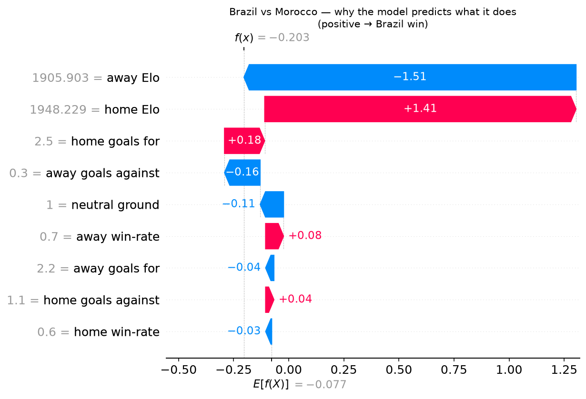
  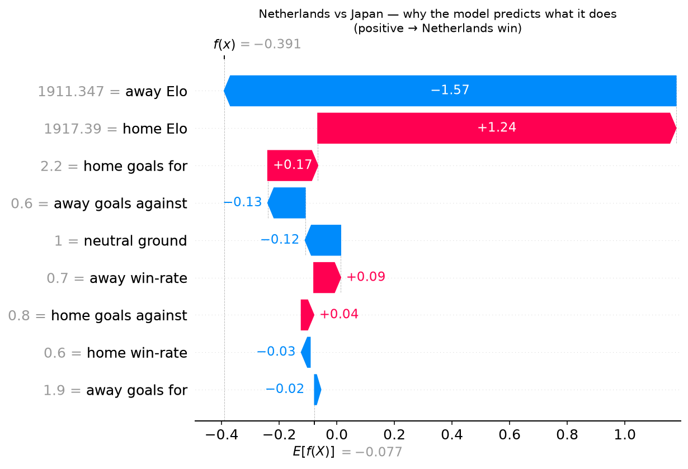
</p>

**How stable is it?** — re-running across different settings (form window, Elo
speed), the predictions barely move: Brazil stays 32–42%, the Netherlands 34–37%.

<p align="center">
  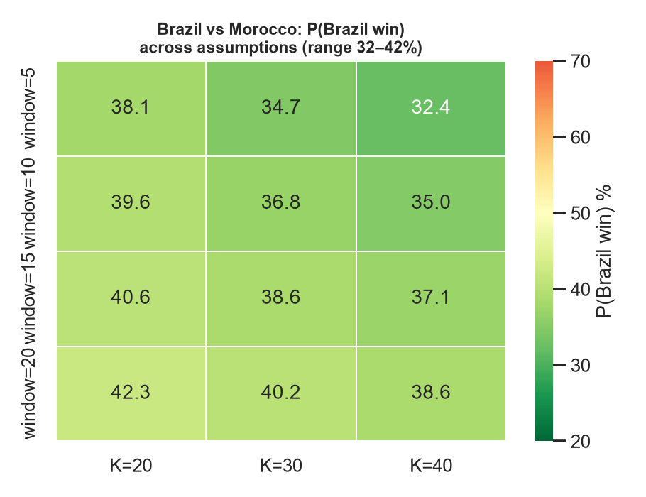
  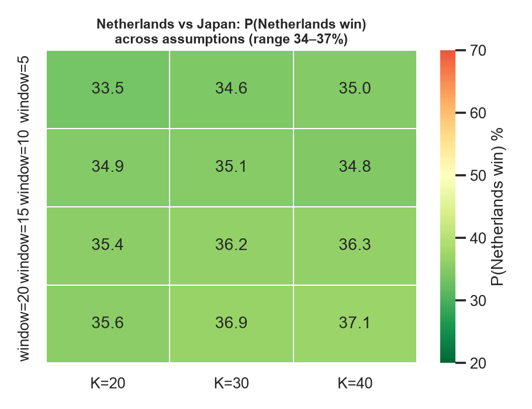
</p>

## Model vs Polymarket vs other models

Tracked against the **Polymarket** market and **[sujar.tech](https://www.instagram.com/sujar.tech/)**
(a popular analyst running a StatsBomb + XGBoost model).

| Match | This model | sujar.tech | Polymarket | Result |
|---|---|---|---|---|
| Brazil – Morocco | 36 / 28 / 36 | 39 / 32 / 29 | 59 / 26 / 17 | **1–1** |
| Netherlands – Japan | 36 / 30 / 34 | 53 / 29 / 18 | 48 / 28 / 26 | *pending* |

So far the model reads matches as more even than the market, which leans on the
favourite. On Brazil–Morocco that paid off.

---

## 🥊 MMA predictor (UFC, June 15)

Same playbook applied to the UFC card — fighter Elo + skill ratings instead of
team form. Code lives in [`mma/`](mma/), benchmarked against Polymarket and
**[leo.taps](https://www.instagram.com/leo.taps/)** (an MMA analyst with a similar model).

The honest headline: **in MMA the market is hard to beat.** Our backtest lands
~65% vs the market's ~70% — the opposite of football. One punch ends a fight, and
the betting market prices in style and intangibles that raw stats miss.

<p align="center">
  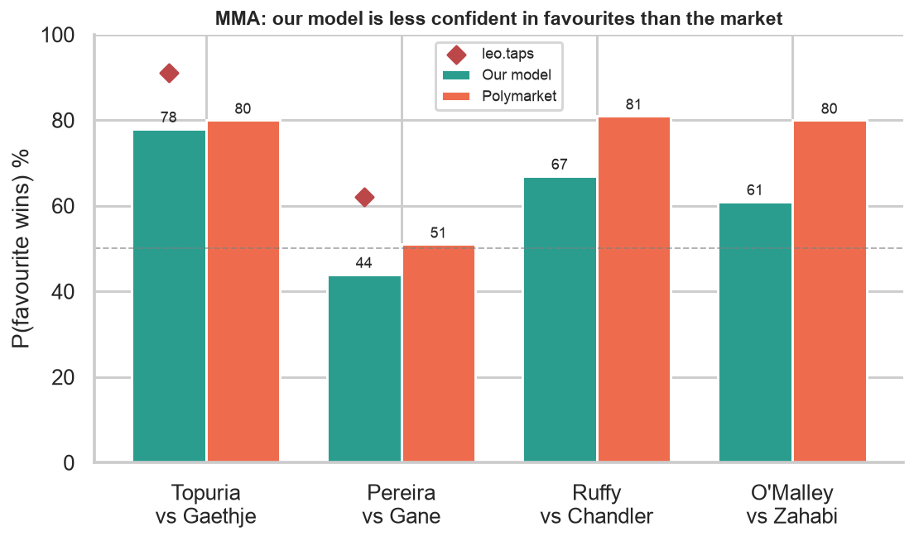
</p>

| Fight | Our model | leo.taps | Polymarket |
|---|---|---|---|
| Topuria – Gaethje | Topuria 78% | Topuria 91% | Topuria 80% |
| Pereira – Gane | Gane 56% | Pereira 62% | ~coin flip |
| Ruffy – Chandler | Ruffy 67% | — | Ruffy 81% |
| O'Malley – Zahabi | O'Malley 61% | — | O'Malley 80% |

Same pattern as football: the model is **less confident in favourites** than the
market. Calibration and robustness checks carry over:

<p align="center">
  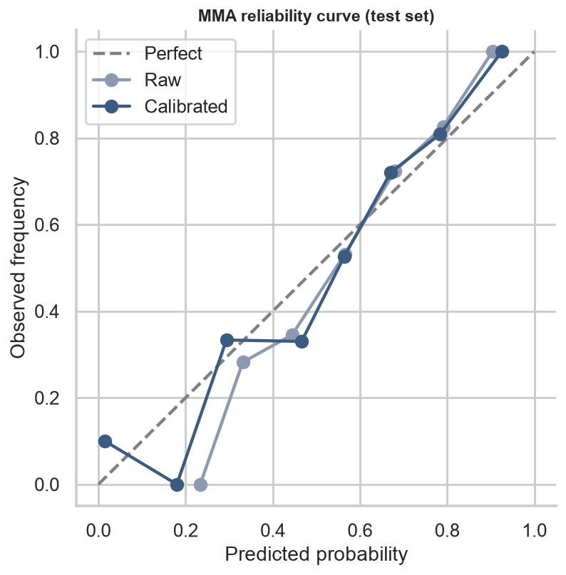
  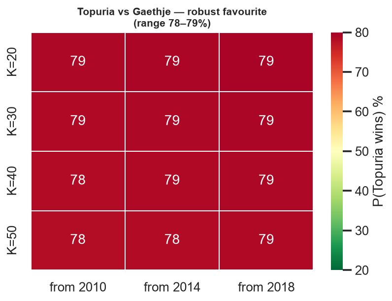
</p>

The predictions are stable across Elo settings and training windows (Topuria
78–79%, Gane 55–57%).

**What this build mostly taught: debugging and skepticism.**
- An early run predicted the underdog at 64% — a bug, not an edge: mixed
  difference-sign conventions plus a "Red corner wins 58%" bias leaking in. Fixed
  by computing all features one way and averaging over both corners.
- Tried to turn an analyst's "Gane is southpaw, open stance" read into a feature —
  but the data (and UFC.com) say **both fighters are orthodox**. The expert's
  premise was wrong, which flips the argument. Verify the input before modelling it.
- Finish method (KO/Sub/Decision) and round are predictable in principle but barely
  beat guessing — the finer the question, the more it's just randomness.

## Files

| file | role |
|---|---|
| `build_dataset.py` | turn raw matches into leakage-safe form features |
| `train.py` / `train_v3_elo.py` | train + backtest |
| `predict_match.py` | predict any fixture (logreg + XGBoost, 3-way) |
| `make_viz.py`, `make_shap.py`, `make_sensitivity.py` | the charts above |
| [`mma/`](mma/) | the UFC predictor (fighter Elo, skill ratings, method/round) |

## Run it

```bash
python -m venv .venv && source .venv/bin/activate
pip install pandas scikit-learn xgboost matplotlib seaborn shap requests python-dotenv

mkdir -p data
curl -sSL https://raw.githubusercontent.com/martj42/international_results/master/results.csv \
  -o data/international_results.csv
python build_dataset.py
python predict_match.py "Brazil" "Morocco"
```

## Data

- [martj42/international_results](https://github.com/martj42/international_results) — match results
- [StatsBomb open data](https://github.com/statsbomb/open-data) — event data (xG, possession)
