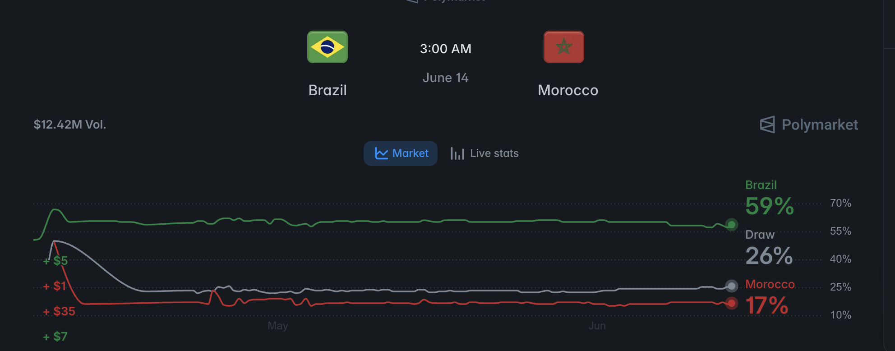

# ⚽ World Cup 2026 Match Predictor

A football match-outcome predictor that estimates **win / draw / loss
probabilities** for any international fixture — and benchmarks itself against
a real-money prediction market.

Built from scratch as a hands-on intro to classical ML. The goal was to
understand every line, not just call a library — so the repo also documents
what *didn't* work and why.

> **Headline:** on Brazil vs Morocco, the model read an even match (36/28/36)
> while the market heavily favoured Brazil (59/26/17). It finished **1–1**,
> with near-identical expected goals (1.28 vs 1.24). Data beat hype.

<p align="center">
  
</p>

---

## What it does

Given two national teams, it predicts the outcome from each team's **recent
form** (win rate, goals scored/conceded), an **Elo strength rating**, and
whether the match is on neutral ground.

```bash
python predict_match.py "Netherlands" "Japan"
```
```
3-WAY            logreg    XGBoost
  Netherlands     35.7%     35.3%
  Draw            30.2%     28.6%
  Japan           34.1%     36.1%
```

## How it works

```
49k international results (1872–2026)
        │  build_dataset.py — clean, leakage-safe rolling form
        ▼
25k matches since 2000  (form features + Elo + answer)
        │  train.py / train_v3_elo.py — logistic regression + backtest
        ▼
71% accuracy on held-out matches  (chronological split, no leakage)
        │  predict_match.py — train on all data, predict one match
        ▼
win / draw / loss probabilities
```

Two anti-leakage rules drive the whole pipeline:
- **Form is computed only from matches *before* each game** (`shift(1)` + rolling window).
- **The model is tested on *future* matches** (split by date, never shuffled).

## The feature-engineering story

The most important lesson, measured rather than assumed: **a single good
feature beat every fancier model.**

<p align="center">
  
</p>

| Version | Change | Backtest |
|---|---|---|
| v1 | form only | 65.0% |
| v2 | XGBoost + rich StatsBomb features (xG, possession), few matches | 57.3% — overfit |
| **v3** | **+ Elo rating (opponent strength)** | **71.2%** ✅ |
| v6 | XGBoost on form + Elo | 70.7% — no gain over logreg |
| v7 | + match importance | 71.1% — no gain (symmetric feature) |

**Takeaway:** features ≫ data volume ≫ model choice. Switching to XGBoost did
nothing (3 separate tests); one domain feature (Elo) added +6 points.

## Calibration & validation

- **Probabilities are calibrated** — when the model says 30%, the home team
  really wins ≈29% of the time (`train_v8_calibration.py`). So "36% Brazil"
  is an honest 36%.
- **Validated against the market** — see [`CALIBRATION.md`](CALIBRATION.md) and
  the post-match analysis in [`POSTMORTEM.md`](POSTMORTEM.md).

<p align="center">
  
  <br><em>Polymarket ($12.4M volume) had Brazil at 59% — the model disagreed, and the 1–1 result + even xG vindicated it.</em>
</p>

## Files

| file | role |
|---|---|
| `build_dataset.py` | feature engineering: raw matches → leakage-safe form features |
| `train.py` | train logistic regression, backtest by date split |
| `train_v3_elo.py` | add the Elo rating feature (the +6pp jump) |
| `train_v5_3way.py` | 3-way prediction via multinomial softmax |
| `compare_models.py`, `train_v6_xgb.py` | logistic regression vs XGBoost |
| `train_v7_importance.py` | match-importance feature (negative result) |
| `train_v8_calibration.py` | probability calibration check |
| `predict_match.py` | **predict any fixture with all models** |
| `make_viz.py` | generate the charts above |

## Run it

```bash
python -m venv .venv && source .venv/bin/activate
pip install pandas scikit-learn xgboost matplotlib requests python-dotenv

# data is gitignored — fetch it:
mkdir -p data
curl -sSL https://raw.githubusercontent.com/martj42/international_results/master/results.csv \
  -o data/international_results.csv
python build_dataset.py          # → data/training_set.csv
python predict_match.py "Brazil" "Morocco"
```

## Data sources

- [martj42/international_results](https://github.com/martj42/international_results) — match results (main dataset)
- [StatsBomb open data](https://github.com/statsbomb/open-data) — event data for v2 (xG, possession)
- football-data.org — team IDs

## What I learned

Leakage, train/test splits by date, overfitting, k-fold cross-validation,
sample-size noise, accuracy vs calibration, binary vs multiclass (softmax),
and the hierarchy that matters most: **good features beat clever models.**
