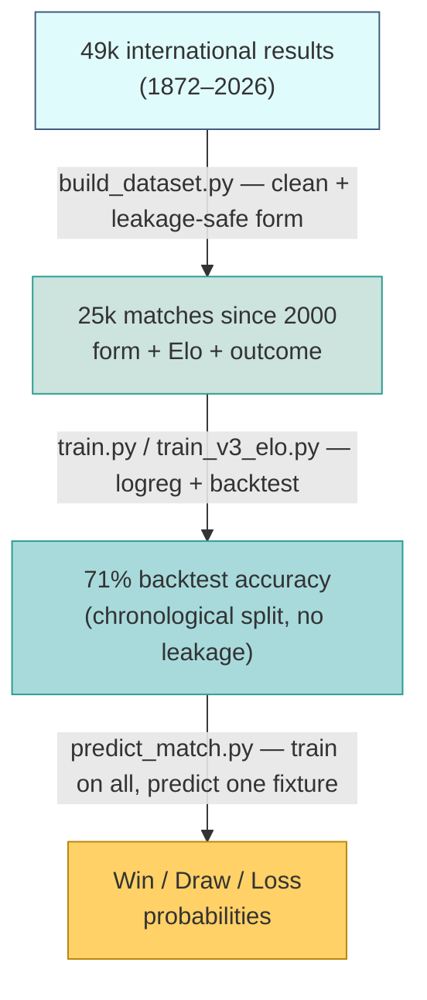
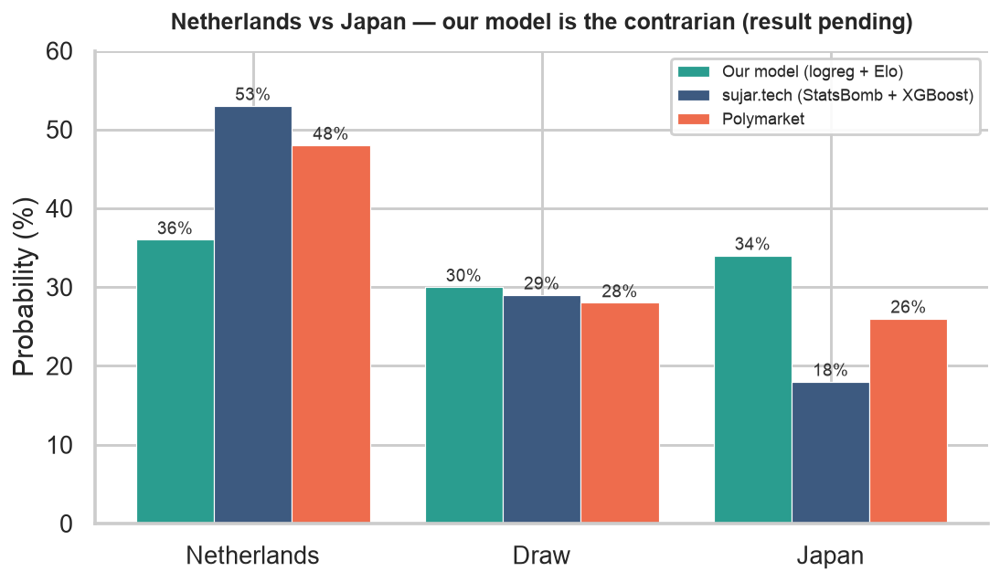

# ⚽ World Cup 2026 Match Predictor


A side project: a football model that estimates **win / draw / loss
probabilities** for any international fixture, benchmarked live against the
Polymarket prediction market.

The idea was simple — build a clean results-based model and see how it stacks
up against a $12M betting market on real World Cup matches.

> **Brazil vs Morocco:** the model called an even match (36/28/36) while the
> market heavily favoured Brazil (59/26/17). It finished **1–1**, with
> near-identical expected goals (1.28 vs 1.24). An independent StatsBomb +
> XGBoost model landed in the same place (39/32/29) — two different methods,
> same read, with the market as the outlier.

<p align="center">
  
</p>

---

## What it does

Given two national teams, it predicts the outcome from each team's **recent
form** (win rate, goals scored/conceded), an **Elo strength rating**, and
whether the match is on neutral ground.

```bash
python predict_match.py "Netherlands" "Japan"
```
```
3-WAY            logreg    XGBoost
  Netherlands     35.7%     35.3%
  Draw            30.2%     28.6%
  Japan           34.1%     36.1%
```

## How it works



Two rules keep the backtest honest:
- **Form uses only matches *before* each game** (`shift(1)` + rolling window).
- **The model is tested on *future* matches** (split by date, never shuffled).

## Model development

Iterations and what moved the accuracy, measured on the same held-out backtest:

<p align="center">
  
</p>

| Version | Change | Backtest |
|---|---|---|
| v1 | form only | 65.0% |
| v2 | XGBoost + rich StatsBomb features (xG, possession), few matches | 57.3% |
| **v3** | **+ Elo rating (opponent strength)** | **71.2%** |
| v6 | XGBoost on form + Elo | 70.7% |
| v7 | + match importance | 71.1% |

The Elo feature added +6 points; switching to XGBoost added nothing across
three separate tests. On this problem, **features matter more than model
choice.**

## Calibration

Probabilities are calibrated — when the model says 30%, the home side wins
≈29% of the time (`train_v8_calibration.py`), so the percentages mean what
they say.

## Benchmark vs Polymarket (and other models)

Each fixture is tracked against the **Polymarket** market and against
**[sujar.tech](https://www.instagram.com/sujar.tech/)** — a popular Instagram
analyst running a StatsBomb + XGBoost model — for an ongoing head-to-head.

| Match | Our model (W/D/L) | sujar.tech | Polymarket | Result |
|---|---|---|---|---|
| Brazil – Morocco | 36 / 28 / 36 | 39 / 32 / 29 | 59 / 26 / 17 | **1–1** (xG 1.28–1.24) |
| Netherlands – Japan | 36 / 30 / 34 | 53 / 29 / 18 | 48 / 28 / 26 | *pending* |

On Brazil–Morocco both data models converged on an even match and beat the
market. On Netherlands–Japan they split: ours is the contrarian, reading an
even match while sujar.tech and the market favour the Netherlands.

<p align="center">
  
</p>

Full write-up in [`POSTMORTEM.md`](POSTMORTEM.md) and [`CALIBRATION.md`](CALIBRATION.md).

## Files

| file | role |
|---|---|
| `build_dataset.py` | feature engineering: raw matches → leakage-safe form features |
| `train.py` | logistic regression + backtest by date split |
| `train_v3_elo.py` | Elo opponent-strength feature |
| `train_v5_3way.py` | 3-way prediction via multinomial softmax |
| `compare_models.py`, `train_v6_xgb.py` | logistic regression vs XGBoost |
| `train_v8_calibration.py` | probability calibration |
| `predict_match.py` | **predict any fixture with all models** |
| `make_viz.py` | generate the charts above |

## Run it

```bash
python -m venv .venv && source .venv/bin/activate
pip install pandas scikit-learn xgboost matplotlib requests python-dotenv

mkdir -p data
curl -sSL https://raw.githubusercontent.com/martj42/international_results/master/results.csv \
  -o data/international_results.csv
python build_dataset.py
python predict_match.py "Brazil" "Morocco"
```

## Data sources

- [martj42/international_results](https://github.com/martj42/international_results) — match results
- [StatsBomb open data](https://github.com/statsbomb/open-data) — event data (xG, possession)
- football-data.org — team IDs
